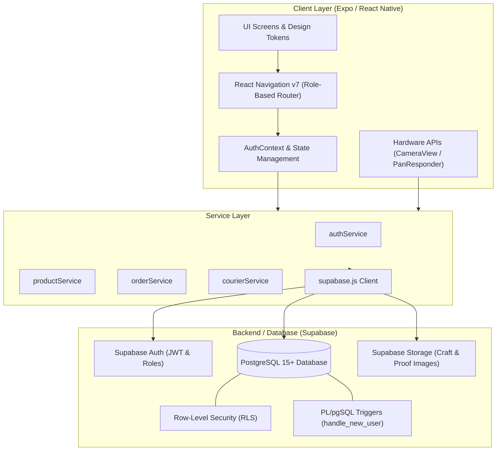
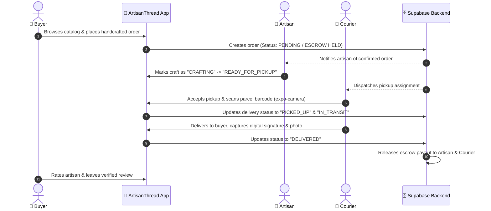

<div align="center">

  

  # 🧵 ArtisanThread
  ### *Handmade with Soul, Delivered with Care.*

  <p align="center">
    <strong>A Next-Generation Multi-Role Mobile Platform Connecting Connoisseurs, Master Craftsmen, and Eco Express Logistics.</strong>
  </p>

  [](https://expo.dev/)
  [](https://reactnative.dev/)
  [](https://supabase.com/)
  [](https://reactnavigation.org/)
  [](LICENSE)
  [](#-running-the-application)

  <br />

  <p align="center">
    <a href="#-project-overview">Project Overview</a> •
    <a href="#-group-members--subsystems">Team & Modules</a> •
    <a href="#-key-features--modules">Features</a> •
    <a href="#-system-architecture">Architecture</a> •
    <a href="#-design-system--palette">Design System</a> •
    <a href="#-database-schema--rls">Database</a> •
    <a href="#-getting-started">Installation</a>
  </p>

</div>

---

## 📖 Project Overview

**ArtisanThread** is an end-to-end multi-role mobile commerce and specialized logistics platform. It bridges the traditional divide between rural **Master Artisans**, conscious **Art Collectors (Buyers)**, and dedicated **Eco Express Couriers**.

Traditional craftspeople face critical hurdles: lack of digital presence, inventory tracking challenges, fragile parcel damage, and payment insecurity. Meanwhile, buyers seek verified authenticity and protected transactions.

ArtisanThread solves this with a unified, role-adaptive mobile architecture:
- 🏺 **Artisans** run a digital atelier, listing crafts, managing stock, and scheduling white-glove courier pickups.
- 🎨 **Buyers** discover certified heritage creations, track shipments in real time, and transact through secure escrow protection.
- 🚚 **Couriers** receive optimized routes, scan parcels using device hardware cameras, correct delivery addresses dynamically, and capture digital signatures upon delivery.

---

## 👥 Group Members & Subsystems

This project was engineered as a collaborative team endeavor, partitioned into dedicated subsystems and features:

| Subsystem / Module | Team Member | Student ID / Role | Branch Reference | Key Deliverables |
| :--- | :--- | :--- | :--- | :--- |
| **Module A:** Universal Onboarding & Auth | **Irusha Dilshan** | `IT23768758`<br>*(Project Lead)* | `feature/group-a-onboarding` | Dynamic vector onboarding (A1/A2/A3), Multi-role selector, OTP validation, Supabase Auth session engine |
| **Module B:** Buyer Marketplace & Catalog | **Group Member B** | *(Contributor)* | `feature/group-b-buyer` | Curated handicraft catalog, Category filters, Real-time search, Buyer profile, Order tracking |
| **Module C:** Checkout, Escrow & Orders | **Group Member C** | *(Contributor)* | `feature/group-c-checkout-escrow` | Secure cart & checkout, Escrow status state machine, Transaction logs, Order itemization |
| **Module D:** Artisan Atelier & Inventory | **Group Member D** | *(Contributor)* | `feature/group-d-artisan` | Workshop metrics, Inventory creator/editor, Low-stock alerts, Dispatch preparation |
| **Logistics Suite:** Eco Express Courier | **Collaborative Core** | *(Team Cross-Functional)* | `development` / `main` | Camera parcel scanner (`expo-camera`), Live delivery transit, Signature pad (`PanResponder`), Geolocation fix |

---

## 🏗️ System Architecture

ArtisanThread is structured around clean separation of concerns, combining React Native client-side state with Supabase cloud infrastructure:



### 🔄 End-to-End Order & Delivery Lifecycle



---

## ✨ Key Features & Modules

### 1. 🛡️ Module A — Interactive Onboarding & Role-Based Auth
- **Vector Illustrated Slides:** High-fidelity pure-React-Native vector artwork illustrating courier safety (A1), artisan craft creation (A2), and buyer trust (A3).
- **Multi-Role Persona Engine:** Instant switching and isolated routing for `Buyer`, `Artisan`, and `Courier`.
- **Flexible Authentication:** Email & phone credential authentication, OTP verification screens, and automatic session restoration.

### 2. 🛍️ Module B — Buyer Handcrafted Discovery
- **Curated Exploration:** Browse verified handcrafted crafts across categories (*Textiles*, *Ceramics*, *Woodcraft*, *Metalwork*, *Jewelry*).
- **Instant Search & Real-Time Sync:** Direct integration with live database records with pull-to-refresh.
- **Shipment Tracking:** Real-time visibility into parcel preparation, transit status, and estimated arrival.

### 3. 💳 Module C — Checkout, Escrow & Order System
- **Escrow-Backed Commerce:** Funds are securely locked during production and transit, protecting both buyer funds and craftsman labor.
- **Transparent Status Progression:** `PENDING` ➔ `CONFIRMED` ➔ `CRAFTING` ➔ `READY_FOR_PICKUP` ➔ `IN_TRANSIT` ➔ `DELIVERED`.

### 4. 🏺 Module D — Master Artisan Workshop (Atelier)
- **Studio Dashboard:** Overview of daily revenue, pending orders, and scheduled courier pickups.
- **Craft Inventory Manager:** Rapid craft listing modal with price setting, stock level controls, and automatic *Low Stock* / *Sold Out* tags.
- **Atelier Profile:** Master craftsman bio, heritage story, and workshop location badge.

### 5. 🚚 Logistics Suite — Eco Express Courier Companion
- **Hardware Barcode & Parcel Scanner:** Embedded camera scanning via `expo-camera` with animated laser HUD, torch toggle, and manual override.
- **In-Transit Navigation:** Dynamic waypoints, sender/recipient metadata, and delivery route optimizer.
- **Address Correction Engine:** Geolocation and note updates for rural or hard-to-find workshops (`FixAddressScreen`).
- **Proof of Delivery (PoD):** Interactive touch-gesture signature canvas (`PanResponder`) and camera photo verification.
- **Courier Operations:** Real-time daily earnings calculation, shift summary, tip tracking, and 5-star courier rating system.

---

## 🎨 Design System & Palette

ArtisanThread features an earthy, heritage-inspired color palette tailored to authentic craftwork:

| Color Name | Hex Code | Purpose | Preview |
| :--- | :--- | :--- | :---: |
| **Primary Deep Green** | `#004D40` | Main Brand & Buyer Primary Accent |  |
| **Primary Light Teal** | `#00796B` | Active state toggles, icons, and CTA highlights |  |
| **Forest Dark** | `#00251A` | Navigation headers, app bar background |  |
| **Primary Muted Mint** | `#E0F2F1` | Badge backgrounds & subtle chip fills |  |
| **Terracotta Clay** | `#A0522D` | Master Artisan role identifier & studio tags |  |
| **Logistics Sapphire** | `#0D47A1` | Courier & transit fleet status highlights |  |
| **Heritage Gold** | `#D4AF37` | Rating stars, connoisseur badges & certifications |  |
| **Background Paper** | `#F7F9F8` | Warm tinted canvas surface for ergonomic reading |  |

---

## 🗄️ Database Schema & RLS

The database is built on **PostgreSQL via Supabase**, secured with **Row Level Security (RLS)**:

```
┌─────────────────┐       ┌─────────────────┐       ┌─────────────────┐
│    profiles     │       │    products     │       │     orders      │
├─────────────────┤       ├─────────────────┤       ├─────────────────┤
│ id (UUID, PK)   │◄──┐   │ id (UUID, PK)   │◄──┐   │ id (UUID, PK)   │
│ email           │   └───│ artisan_id (FK) │   │   │ buyer_id (FK)───┼──┐
│ full_name       │       │ title           │   └───│ order_number    │  │
│ role (ENUM)     │       │ price           │       │ status (ENUM)   │  │
│ phone           │       │ stock           │       │ total_amount    │  │
│ metadata (JSON) │       │ is_active       │       │ shipping_addr   │  │
└─────────────────┘       └─────────────────┘       └─────────────────┘  │
         ▲                                                   ▲           │
         │                ┌─────────────────┐                │           │
         │                │   order_items   │                │           │
         │                ├─────────────────┤                │           │
         │                │ id (UUID, PK)   │                │           │
         │                │ order_id (FK)───┼────────────────┘           │
         │                │ product_id (FK) │                            │
         │                │ quantity, price │                            │
         │                └─────────────────┘                            │
         │                                                               │
         │                ┌─────────────────┐                            │
         │                │   deliveries    │                            │
         │                ├─────────────────┤                            │
         │                │ id (UUID, PK)   │                            │
         └────────────────┼─courier_id (FK) │                            │
                          │ order_id (FK)───┼────────────────────────────┘
                          │ tracking_code   │
                          │ status (ENUM)   │
                          │ proof_image_url │
                          └─────────────────┘
```

- **Row Level Security (RLS):** Buyers only view their purchases; Artisans only edit their crafts; Couriers only update active assignments.
- **Automatic User Provisioning:** PostgreSQL `AFTER INSERT` trigger (`handle_new_user`) automatically provisions profile entities from `auth.users`.

---

## 📁 Project Structure

```text
ArtisanThread/
├── App.js                         # Root application entry & provider composition
├── app.json                       # Expo application manifest & permissions
├── package.json                   # Dependencies & npm scripts
├── supabase/                      # Database migrations & configuration
│   ├── schema.sql                 # Core tables, enums, triggers & RLS policies
│   ├── seed.sql                   # Sample artisans, crafts, and delivery tasks
│   └── fix_courier_rls_and_seed.sql
└── src/
    ├── constants/
    │   ├── colors.js              # Brand palette, role accents & neutrals
    │   ├── theme.js               # Elevation shadows, border radii & spacing
    │   └── index.js
    ├── context/
    │   ├── AuthContext.js         # Auth state, session persistence & role switcher
    │   └── index.js
    ├── services/
    │   ├── supabase.js            # Configured Supabase JavaScript client
    │   ├── authService.js         # User registration, login, profile fetch
    │   ├── productService.js      # Catalog querying & artisan inventory mutations
    │   ├── orderService.js        # Checkout, order creation & status updates
    │   ├── courierService.js      # Parcel pickup, scanning, transit & PoD
    │   └── index.js
    ├── components/
    │   ├── Button.js              # Reusable buttons (primary, outline, ghost)
    │   ├── Card.js                # Tactile elevated container cards
    │   ├── RoleBadge.js           # Visual chip for Buyer / Artisan / Courier
    │   ├── RoleSwitcher.js        # Instant role toggle bar for development & demos
    │   ├── ScreenHeader.js        # Safe-area app bar with user meta & sign-out
    │   └── index.js
    ├── navigation/
    │   ├── routes.js              # Navigation route names & role enum constants
    │   ├── RootNavigator.js       # Dynamic role selector router
    │   ├── AuthNavigator.js       # Onboarding, Login, Register, OTP stack
    │   ├── BuyerNavigator.js      # Marketplace, Orders, and Profile tabs
    │   ├── ArtisanNavigator.js    # Studio Dashboard, Crafts, Orders tabs
    │   ├── CourierNavigator.js    # Fleet Home, Scan, Transit, Routes, PoD stack
    │   └── index.js
    └── screens/
        ├── auth/                  # Group A: Onboarding & Authentication
        │   ├── OnboardingScreen.js
        │   ├── WelcomeBackScreen.js
        │   ├── LoginScreen.js
        │   ├── RegisterScreen.js
        │   ├── CreateAccountScreen.js
        │   ├── ChooseRoleScreen.js
        │   ├── OTPVerificationScreen.js
        │   └── ForgotPasswordScreen.js
        ├── buyer/                 # Group B & C: Buyer Marketplace & Orders
        │   ├── BuyerHomeScreen.js
        │   ├── BuyerOrdersScreen.js
        │   └── BuyerProfileScreen.js
        ├── artisan/               # Group D: Workshop & Craft Management
        │   ├── ArtisanDashboardScreen.js
        │   ├── ArtisanProductsScreen.js
        │   ├── ArtisanOrdersScreen.js
        │   └── ArtisanProfileScreen.js
        └── courier/               # Logistics Suite: Eco Express Courier
            ├── CourierHomeScreen.js
            ├── PickupRequestScreen.js
            ├── ScanParcelScreen.js
            ├── DeliveryTransitScreen.js
            ├── ConfirmDeliveryScreen.js
            ├── FixAddressScreen.js
            ├── DeliveryUnsuccessfulScreen.js
            ├── CourierDeliveriesScreen.js
            ├── CourierRoutesScreen.js
            ├── CourierEarningsScreen.js
            ├── CourierRatingScreen.js
            ├── CourierNotificationsScreen.js
            └── CourierProfileScreen.js
```

---

## 🚀 Getting Started

Follow these steps to set up and run ArtisanThread on your local workstation:

### 1. Prerequisites
- **Node.js**: `v18.x` or higher installed ([Download Node](https://nodejs.org/))
- **Expo Go App**: Installed on your mobile phone ([Android](https://play.google.com/store/apps/details?id=host.exp.exponent) / [iOS](https://apps.apple.com/app/expo-go/id982107779))
- **Git**: For version control

### 2. Clone the Repository
```bash
git clone https://github.com/IrushaDilshan/ArtisanThread.git
cd ArtisanThread
```

### 3. Install Dependencies
```bash
npm install
```

### 4. Configure Environment Variables
Copy the example environment file and configure your Supabase credentials:
```bash
cp .env.example .env
```
Ensure your `.env` contains:
```env
EXPO_PUBLIC_SUPABASE_URL=your_supabase_project_url
EXPO_PUBLIC_SUPABASE_ANON_KEY=your_supabase_anon_public_key
```
*(A pre-configured development backend is linked in `.env.example` for instant evaluation).*

### 5. Launch the Development Server
```bash
npx expo start
```

### 6. Preview the App
- 📱 **Physical Device:** Open **Expo Go** on your iOS/Android phone and scan the terminal QR code.
- 🤖 **Android Emulator:** Press `a` in the terminal.
- 🍏 **iOS Simulator:** Press `i` in the terminal (macOS required).
- 🌐 **Web Browser:** Press `w` in the terminal.

---

## 🌿 Git Branching & Workflow

To maintain code quality across all group sub-teams, the repository utilizes the GitFlow branching convention:

```text
  main (Production Releases)
    ▲
    │
  development (Staging & Integration)
    ▲
    ├────── feature/group-a-onboarding
    ├────── feature/group-b-buyer
    ├────── feature/group-c-checkout-escrow
    └────── feature/group-d-artisan
```

- `main`: Clean, validated release branch.
- `development`: Active integration branch where sub-team features merge.
- `feature/*`: Dedicated branches for each group member's deliverables.

---

## 🔮 Roadmap & Future Enhancements

- [ ] **Augmented Reality (AR) Craft Preview:** Allow buyers to visualize 3D pottery and textiles in their living space using ARKit/ARCore.
- [ ] **Smart Escrow Contracts:** Decentralized ledger settlement upon delivery confirmation.
- [ ] **Multilingual Artisan Voice Assistant:** Voice-driven craft listing for artisans in native regional languages.
- [ ] **Offline-First Courier Sync:** Queue delivery signatures and scan logs locally when operating in remote areas with zero cell reception.

---

## 📄 License & Attribution

This project is licensed under the **MIT License** — see the [LICENSE](LICENSE) file for complete details.

Developed with ❤️ by the **ArtisanThread Engineering Team**.
